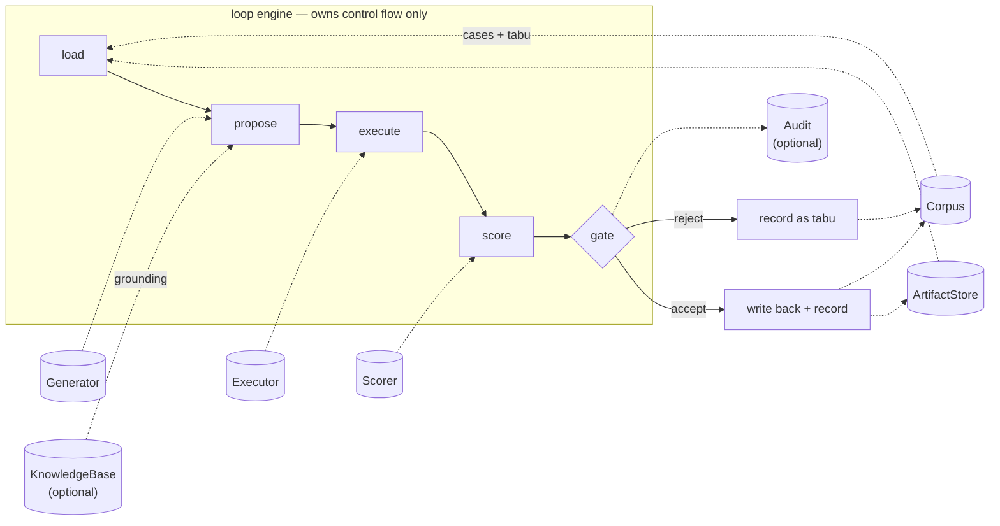

# evol

[](https://github.com/hop-top/evol/actions/workflows/ci-go.yml)
[](https://github.com/hop-top/evol/blob/main/.12fcc.json)
[](LICENSE)

**evol rewrites the skill files, prompts, and configs your agent works
from — and proves, statistically, whether the rewrite was actually
better.**

It is an evaluation loop with a promotion gate: propose candidate
revisions, run them against real cases, score them, and promote only
what clears a mean threshold **and** a paired-bootstrap significance
test. Its most useful output is a rejection.

On the record so far: **30 candidates judged, 26 rejected**, one
verified promotion at **+17% relative, p = 0.0002**.

---

## What sets it apart

**1. It tells you *no*, with statistics.**
The gate is `mean ≥ baseline + δ` **and** `paired-bootstrap p ≤ 0.05`,
seeded and reproducible. The pairing unit is the *case*, not the trial,
so re-running the same case cannot manufacture significance. Below 8
paired cases it disables the test and says so rather than pretending.
→ [the reject record](e2e/runs/gen1-generations.jsonl)

**2. Any agent CLI. None privileged.**
A four-line runner contract — stdin, two env vars, stdout. Eight
reference shims ship (`claude`, `codex`, `gemini`, `opencode`, `foo`,
`fabric`, `llm`, `ollama`), each ~15 lines. Your own harness is a shim
away; there is no integration to wait for.
→ [`e2e/bin/runners/`](e2e/bin/runners/)

**3. Any model, local or hosted — zero keys required.**
Eleven provider schemes by URI: `anthropic`, `openai` (and any
OpenAI-compatible endpoint via `?base_url=`), `openrouter`, `xai`,
`groq`, `together`, `fireworks`, `deepseek`, `mistral`, `ollama`,
`routellm`. The entire loop runs against local Ollama or LM Studio with
no API key at all. The provider is recorded per candidate, so model
choice becomes part of the eval space rather than a config afterthought.
→ [provider table](adapters/generator-llm/README.md)

**4. Not just skills.**
`skill`, `prompt`, `command`, and `tool-config` are the reference
kinds, not the boundary: an artifact is any versioned text the store
can resolve — frontmatter optional, body arbitrary — so a DSPy program,
a structured-output schema, a workflow definition, an agent's memory
file, or a one-liner — a prompt, or a chained shell command — is one
ArtifactStore ref away. It points at the files you already have — no
migration, no proprietary format.
→ [ArtifactStore contract](spec/port-artifactstore.md)

**5. Extend it in any language. No SDK.**
Ports are one JSON object in, one out, over stdio. The proof is a
third-party KnowledgeBase adapter written in one file of standard-library
Python, from the spec text alone, zero evol code imported, in roughly one
sitting. Six contracts are published v1 under an additive-only
commitment.
→ [the outsider's account](examples/third-party/obsidian-kb/)

**6. Reproducible after the fact.**
Cassette record/replay keys on candidate content hash + provider + case
input, so a promotion can be re-verified without spending an API call —
the CI regression gate does exactly that, with **zero keys in CI**. Every
candidate, verdict, and rationale lands in a corpus; rejects feed back to
the generator as a tabu list so it stops re-proposing last week's
failure.

---

## How it compares

Three things a researcher is usually choosing between:

| | Hand-rolled eval script | Prompt optimizers<br>(DSPy GEPA/MIPROv2) | Agent self-evolution repos | **evol** |
|---|---|---|---|---|
| **Promotion gated on significance** | rarely | n/a — optimizes, doesn't gate | typically "improvement > 0" | **mean + paired bootstrap** |
| **Keeps rejects as memory** | no | no | usually discarded | **corpus + tabu** |
| **Agent CLI** | yours only | n/a | usually one, coupled | **any, via runner contract** |
| **Model** | yours | configurable | often pinned | **11 schemes, local or hosted** |
| **Deterministic replay** | no | no | rare | **cassettes, zero-key CI gate** |
| **Extensible without a fork** | n/a | Python | Python | **any language, JSON/stdio** |
| **Operates on your existing files** | yes | signatures/programs | `SKILL.md` | **skill, prompt, command, tool-config** |
| **Maturity** | — | production | early | **pre-alpha code, published spec** |

**Optimizers and evol are not rivals.** DSPy optimizes; evol decides
whether the result earned promotion. An optimizer drops in as a
Generator adapter — that seam exists precisely so it can.

A detailed, receipts-first audit against one named public
implementation — including where evol's own loop failed — is in the
[Self-Evolution Scorecard](https://claude.ai/code/artifact/16e72074-05e2-4d33-87bb-3ca7d1ac5193).

---

## Is this for you?

**Use evol if** you have an artifact an agent reads (a skill, prompt,
command, or tool config), a way to invoke that agent from a shell, and a
way to score its output — programmatically or by rubric.

**Don't use evol if** any of these hold:

- **You have fewer than 8 eval cases.** The significance test disables
  itself and you are back to mean-only gating, which is what produced
  this project's one bad promotion.
- **You can't score outputs.** No scorer, no loop. evol will not invent
  a number.
- **You want it to write your cases from your artifact.** It refuses —
  cases synthesized from the artifact alone reward that artifact's own
  blind spots. Synthesis requires knowledge grounding, and its output
  stays quarantined until a human promotes it.
- **You need something battle-tested today.** evol is experimental —
  pre-alpha code under a published spec; flags, layouts, and defaults
  still move between commits.

---

## How it works



The engine owns control flow only. Every I/O exchange crosses a **port**
— a versioned JSON contract spoken over process boundaries.
Implementations are **adapters**: standalone executables in any language.
The engine never links adapter code, which is why swapping the model, the
agent, the knowledge base, or the optimizer is a config change rather
than a fork.

---

## Quick start

Install from source (no packaged release yet; needs `git` + `go`):

```sh
curl -fsSL https://raw.githubusercontent.com/hop-top/evol/main/scripts/install.sh | sh
```

That installs `evol` plus one `evol-adapter-<name>` per reference
adapter — the names [`evol.example.yaml`](evol.example.yaml) wires.
Or work from a clone:

```sh
git clone https://github.com/hop-top/evol && cd evol
make quickstart   # engine + example adapters, then a keyless dry-run
```

Setting up an agent to work on or with evol? Hand it this:

```text
SETUP (agents)
  requires  git, go (or `mise trust && mise run install` for the pinned toolchain)
  build     make quickstart      # engine + adapters -> e2e/bin, keyless dry-run, expect exit 0
  verify    e2e/bin/evol run --config e2e/evol.yaml --dry-run --format json
  live loop e2e/RUNBOOK.md       # needs ANTHROPIC_API_KEY or a local Ollama
  example   e2e/README.md        # layout of the worked example + committed evidence
  extend    spec/README.md       # wire protocol, then spec/port-*.md per port
  conventions adapters/README.md # adapter naming + layout
```

The repo ships a complete worked example under [e2e/](e2e/): a
deliberately mediocre commit-message skill, 16 golden cases (8 train /
8 holdout), a scoring contract, eight runner shims, and committed
regression fixtures. [**e2e/RUNBOOK.md**](e2e/RUNBOOK.md) walks the live
loop end to end.

> **Calibrate before you trust a verdict.** The example eval is tuned so
> the mediocre baseline lands ~0.63–0.72 and a well-written skill reaches
> ~0.91. Swap the agent-under-test model and re-run
> `e2e/bin/calibrate.sh` — an uncalibrated eval silently makes the gate
> either unreachable or trivial.

---

## The evidence

<details>
<summary><b>One verified improvement, and the 26 rejections that make it
credible</b></summary>

| | |
|---|---|
| Artifact | `commit-messages/SKILL.md` (deliberately mediocre) |
| Baseline holdout mean | **0.7049** |
| Promoted holdout mean | **0.8236** (+17% relative) |
| Significance | **p = 0.0002**, seeded paired bootstrap |
| Eval | 8 holdout cases × 3 trials |
| Verdict | diff-inspected: a genuine semantic upgrade, not a reflow |

Evidence: [`e2e/runs/gen1-improvement.json`](e2e/runs/gen1-improvement.json).
Full history including every reject:
[`e2e/runs/gen1-generations.jsonl`](e2e/runs/gen1-generations.jsonl).

**The ablation matters more than the headline.** Of 27 candidates
proposed from the artifact text alone, exactly one ever passed — a text
reflow that beat the mean on trial noise, back when the gate checked the
mean and nothing else. A human caught it in the diff, reverted it, and
the significance gate exists because of it. Run 5 changed one variable —
proposals grounded in retrieved knowledge through the KnowledgeBase port
— and all three of its candidates cleared the full gate, at p = 0.0002,
0.0041, and 0.0009. **Grounding, not scale.**

The claim is narrow and stays narrow: one artifact, one domain. Read it
as "evol measured one improvement and rejected twenty-six
non-improvements," not "evol improves agents."

</details>

---

## Reference

<details>
<summary><b>The gate</b> — mean delta plus paired-bootstrap significance</summary>

A candidate is promoted only if **both** hold:

```
mean(candidate) ≥ mean(baseline) + delta        # thresholds.delta
paired_bootstrap_p ≤ sig_level                  # thresholds.sig_level, default 0.05
```

One-sided paired bootstrap over 10,000 resamples, seeded
(`thresholds.sig_seed`, default 1) so p-values reproduce exactly. Trials
collapse to a per-case mean before pairing, so extra trials cannot
manufacture significance. Below 8 paired cases the test is disabled and
the run falls back to mean-only gating with a logged warning. A candidate
that clears the mean but fails significance is rejected, with that
rationale recorded.

</details>

<details>
<summary><b>Ports and adapters</b> — six contracts published v1, thirteen
reference adapters</summary>

| Port | Purpose | Reference adapters |
|------|---------|--------------------|
| [ArtifactStore](spec/port-artifactstore.md) | load / write / version the artifact | [artifact-fs](adapters/artifact-fs/) — git-native versioning + restore |
| [Generator](spec/port-generator.md) | propose candidate revisions | [generator-llm](adapters/generator-llm/) — mutation strategies, tabu-aware, provider URIs |
| [Executor](spec/port-executor.md) | run a candidate against an eval case | [executor-apx](adapters/executor-apx/) — subprocess, +cassette replay, +profile isolation |
| [Corpus](spec/port-corpus.md) | cases, verdicts, tabu history, corrections | [corpus-fs](adapters/corpus-fs/) — file-backed |
| [Scorer](spec/port-scorer.md) | score a transcript against a case | [scorer-eva](adapters/scorer-eva/); the e2e example uses a checked-in Python scorer |
| [KnowledgeBase](spec/port-knowledgebase.md) | grounding for proposals + synthesis *(optional)* | [kb-ctxt](adapters/kb-ctxt/), plus a [third-party Python adapter](examples/third-party/obsidian-kb/) |
| [Audit](spec/port-audit.md) *(draft)* | run ledger *(optional)* | [audit-tlc](adapters/audit-tlc/), [audit-fs](adapters/audit-fs/) |

Supporting adapters, same wire protocol:
[gate-ben](adapters/gate-ben/) (benchmark regression gate),
[casegen-llm](adapters/casegen-llm/) (grounded case synthesis),
[cases-crtx](adapters/cases-crtx/) (mine cases from recorded sessions),
[routing-emit](adapters/routing-emit/) (model-routing config from
evidence), [runner-xrr](adapters/runner-xrr/) (cassette record/replay).

Wire protocol and versioning promise: [spec/README.md](spec/README.md)
and [spec/publishing.md](spec/publishing.md).

</details>

<details>
<summary><b>The runner contract</b> — how any agent CLI plugs in</summary>

```
stdin   case input
env     EVOL_CANDIDATE_REF  path to the candidate artifact body
        EVOL_PROVIDER       optional model URI; interpretation is the runner's
stdout  agent output only
exit≠0  run failure (recorded as data, not an adapter error)
```

Eight shims live in [`e2e/bin/runners/`](e2e/bin/runners/) — four
smoke-tested live, four honestly marked untested.

</details>

<details>
<summary><b>CLI surface</b> — seven verbs</summary>

```sh
evol run                      # one evolution run; --artifact or --select, --dry-run
evol targets                  # what's evolvable + per-artifact history
evol cases synth              # grounded synthetic cases (quarantined)
evol cases list               # review the pool, quarantined or all
evol cases promote            # human promotes quarantined cases into gating
evol cases correct            # write a human correction into the pool
evol rollback                 # restore a previous artifact version
evol runs list | show <id>    # read the audit ledger
evol routing emit             # model-routing config from recorded evidence
```

Exit codes for `evol run`: `0` promoted · `1` no improvement · `2` gate
precondition failed · `3` config or adapter error. Other verbs reuse
them; notably `cases synth` exits `2` when the knowledge base yields no
grounding.

On promotion, a configurable hook (`promotion.hook`) hands off to any
publisher with `EVOL_PROMOTED_REF`, `EVOL_PROMOTED_VERSION`, and
`EVOL_PROMOTED_GIT_COMMIT` set. `EVOL_ARTIFACT_GIT=1` makes promotions
and rollbacks git-native. See [docs/promotion.md](docs/promotion.md).

</details>

<details>
<summary><b>Target selection</b> — five policies, including self-scheduling</summary>

Without `--artifact`, `evol run` picks its own target:
`--select never-run | worst | stale | drift | kb-churn`.

`drift` chases the most negative score trend across recent generations.
`kb-churn` chases artifacts whose grounding knowledge moved since the
last evolution — on real KB timestamps, with a documented four-rung
degrade ladder when that signal is absent. A cron firing
`--select kb-churn` is a loop that schedules itself against world
evidence. See [docs/self-scheduling.md](docs/self-scheduling.md).

</details>

<details>
<summary><b>Design rules</b> — the non-negotiables</summary>

- **Write-back is engine behavior, not adapter courtesy.** Every
  candidate and verdict lands in the corpus. A loop without memory is
  re-rolling, not self-improving.
- **The loop must not grade its own homework.** Synthetic cases are
  refused without knowledge grounding and quarantined until a human
  promotes them.
- **Degrade, never fabricate.** Optional ports report
  `{"unavailable": true}` and the engine continues with reduced
  capability. A missing signal produces a documented proxy ladder, never
  invented data.
- **A scorer that cannot score must fail loudly.** Most ports have two
  failure planes; scorers get one, because a fabricated number corrupts
  every downstream verdict.
- **Model choice is data.** The provider that produced each candidate is
  recorded with it.
- **Nothing ships on tests alone.** Bugs found *only* by live exercise:
  stale adapter binaries serving old contracts, cassette identity keyed
  on reassembled instead of source content, a relevance ranker letting a
  10-token note outrank the authoritative one.

</details>

---

## Status and limitations

**Pre-alpha code, published spec.** The port contracts in [spec/](spec/)
are published v1 (`evol: "1"`, additive-only — the commitment is in
[spec/publishing.md](spec/publishing.md)), released only after the loop
demonstrated the verified improvement above. The CLI and reference
adapters remain pre-alpha: flags and layouts may change.

- **No packaged release.** Install is from source
  ([`scripts/install.sh`](scripts/install.sh) or `make quickstart`);
  tagged releases and `go install` wait on an upstream tag-shape
  question.
- **Scoring is programmatic today.** The LLM-judge tier landed upstream
  in the eval engine but the installed build here predates it.
- **Session mining is converter-only.** `cases-crtx` turns recorded
  session envelopes into cases; no live capture pipeline feeds it.
- **Conformance fixtures exist only for KnowledgeBase.** House rule: a
  port gets fixtures once a *second* real adapter exists for it
  ([spec/conformance-plan.md](spec/conformance-plan.md)).
- **The file-backed corpus is the interim implementation.** An indexed
  successor belongs behind the same port.

---

## Docs

- [RUNBOOK](e2e/RUNBOOK.md) — run the loop end to end
- [spec/](spec/README.md) — wire protocol and port contracts; implement an adapter
- [adapters/](adapters/README.md) — reference adapters, naming and layout conventions
- [e2e/](e2e/README.md) — the worked example: layout and committed evidence
- [self-scheduling](docs/self-scheduling.md) — `--select` policies; the loop picks its own target
- [synthesis](docs/synthesis.md) — grounded case synthesis, always quarantined
- [review](docs/review.md) — human review of machine-generated intake
- [promotion](docs/promotion.md) — what happens after the gate, hooks, rollback
- [audit](docs/audit.md) — the run ledger behind `evol runs`
- [routing write-back](docs/routing-writeback.md) — per-model evidence becomes routing config

## Contributing

1. Fork, branch (`feat/my-change`), commit with
   [Conventional Commits](https://www.conventionalcommits.org).
2. `mise trust && mise run install` pins the toolchain; `make check`
   runs what CI runs — lint, tests, link check.
3. Implementing a port adapter? Start at [spec/README.md](spec/README.md)
   for the wire protocol and [adapters/README.md](adapters/README.md)
   for conventions. Any language qualifies — the third-party example
   was written from the spec text alone.
4. Open a PR.

## License

[MIT](LICENSE)
